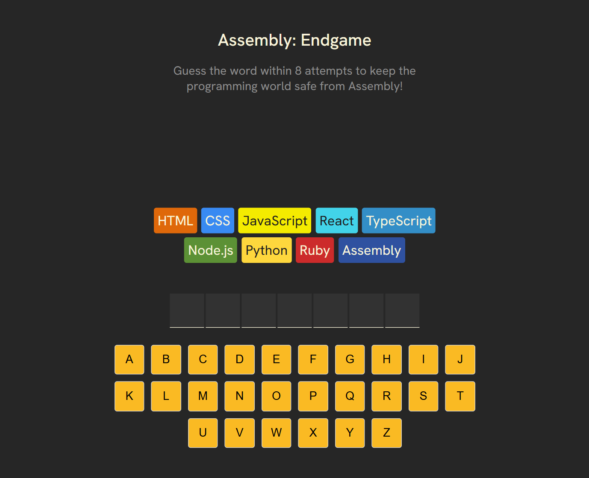
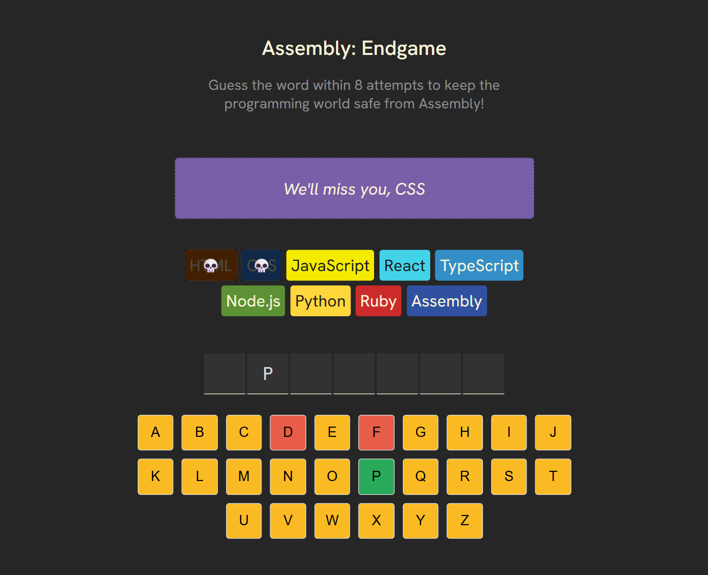
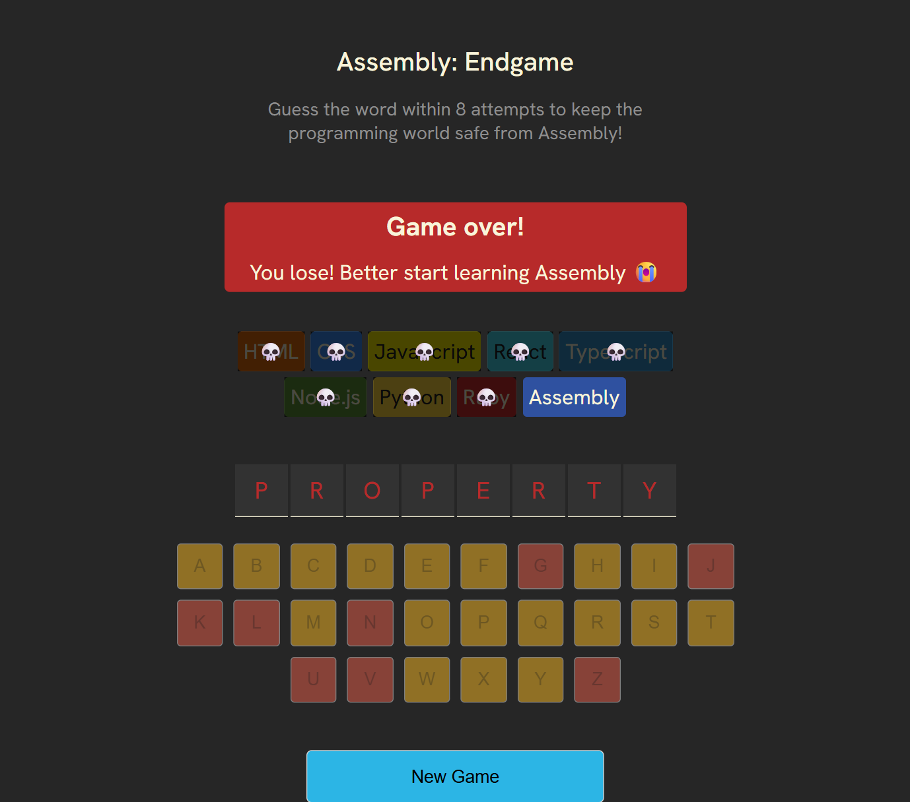
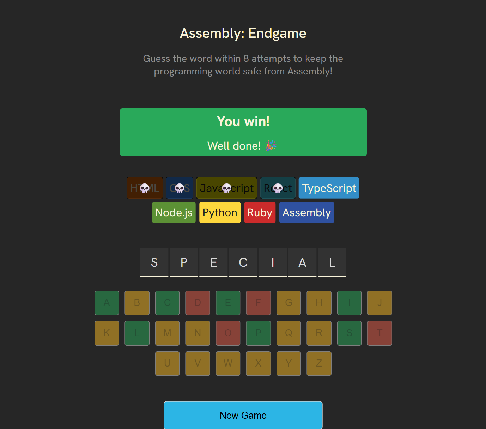
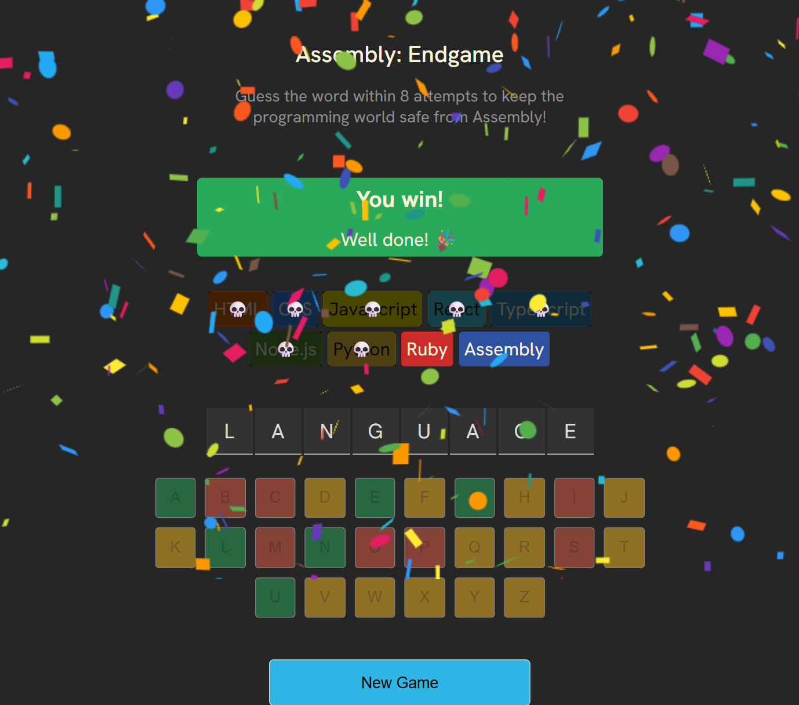

# 🕹️ Assembly: Endgame

A fast-paced, accessible, React-powered word-guessing game where you must save the programming world from Assembly by solving the mystery word before running out of attempts.

## 🚀 Live Demo

👉 [Click here](https://assemblyendgame00.netlify.app/)

## 📸 Screenshots

<p float="left">
  
  
  
  
  
</p>

## 🎮 Features
🧠 Core Gameplay

Random programming-related word each game

Virtual keyboard (A–Z)

Correct & incorrect letter feedback

Chips representing remaining attempts

Skull overlay on each failed attempt

Automatic win/loss detection

Game-over reveal showing missed letters

### 🎉 Visual Enhancements

Confetti animation when the player wins

Dynamic color feedback (green for correct, red for wrong)

“Farewell messages” when losing programming languages

### ♿ Accessibility

aria-live polite updates for screen readers

Accessible keyboard interactions

Visually hidden screen-reader content describing the game state

### 🔁 Game Controls

“New Game” button resets everything

Prevents guessing after game ends

### 🛠️ Tech Stack

React (Hooks)

JavaScript / JSX

clsx (conditional class handling)

react-confetti

CSS Flexbox

Custom utilities (getRandomWord, getFarewellText)

languages.js (theme + attempt definitions)

## 📂 File Structure
```
/src
 ├── AssemblyEndgame.jsx
 ├── languages.js
 ├── utils.js
 ├── styles.css
 ├── components/
 └── assets/
public/
README.md
```

## 📦 Installation & Setup
```bash
git clone https://github.com/Elizbeh/assembly_endgame
cd assembly-endgame
npm install
npm run dev
```

## 🧪 Future Improvements

Add timer mode

Difficulty levels

Sound effects

Hints after several wrong guesses

Theme switching

Multi-language word lists

## 📝 License

MIT License © 2025